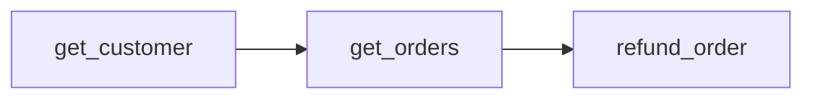
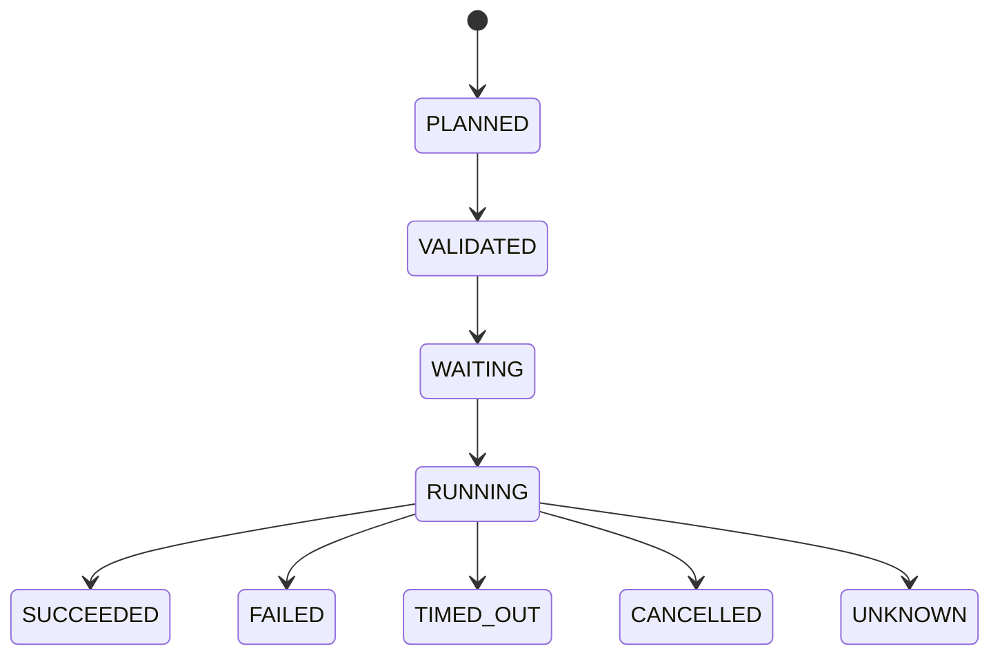

# Agent 多工具调用与并发执行编排问题

## 前言

工具调用，又称 Function Calling、Tool Use 或 Tool Calling，是大模型从“会对话”转向“能落地办事”的关键能力。

传统大语言模型的主要输出是自然语言，而具备工具调用能力的模型可以在自然语言和结构化行动之间进行选择，并通过标准协议与外部系统形成闭环：

```text
理解用户意图
    ↓
选择工具并生成参数
    ↓
外部程序执行工具
    ↓
执行结果返回模型
    ↓
模型继续推理或生成最终回答
```

在这个过程中，协议负责让程序“听懂模型”，训练负责让模型“知道何时以及如何使用工具”，真正的函数执行则始终发生在模型之外。

当一个 Agent 同时接入多个工具以后，问题会进一步复杂化：模型能否一次选择多个工具？这些工具之间是并行还是串行？如果存在资源冲突、部分成功、超时或者重复执行，系统应该如何处理？

本文围绕两个逐层深入的问题展开：

1. **Agent 的多工具调用能力与实现机制；**
2. **工具编排器的并发执行与生产治理。**

全文的主线可以概括为：

> **模型负责提出工具调用，编排器负责把这些不确定的调用请求转换成安全、可控、可恢复的执行计划。**

------

## 一、从 Function Calling 到 Agent

### Function Calling 是什么？

最关键的一点是：**模型并不真正执行函数，它只生成一条“请求调用某个函数”的结构化消息。**

普通对话模型输出的序列大致是：

```text
<assistant>
北京今天大约 20 摄氏度。
```

支持工具调用的模型则学习了另一种输出形态：

```text
<assistant_tool_call>
{
  "name": "get_weather",
  "arguments": {
    "city": "北京"
  }
}
```

这里的 `assistant_tool_call` 可以理解为一种特殊输出通道或消息类型。模型底层仍然是在生成 token，只是它可以生成的“语言”不再只有自然语言，还包括了一套机器可以识别的动作语言。

以 OpenAI 为例，应用在调用模型时可以同时提供工具定义：

```json
{
  "model": "...",
  "input": "北京今天天气怎么样？",
  "tools": [
    {
      "type": "function",
      "name": "get_weather",
      "description": "查询指定城市的实时天气",
      "parameters": {
        "type": "object",
        "properties": {
          "city": {
            "type": "string"
          }
        },
        "required": ["city"],
        "additionalProperties": false
      },
      "strict": true
    }
  ],
  "tool_choice": "auto"
}
```

这实际上是在告诉模型：

```text
你除了回答自然语言之外，还拥有一个叫 get_weather 的动作。
它适用于实时天气查询。
调用它时必须提供 city 参数。
```

`tool_choice: "auto"` 表示模型可以自己决定直接回答，还是调用一个或多个工具；也可以设置为 `required`，或者强制调用指定函数。[OpenAI Function Calling 文档](https://developers.openai.com/api/docs/guides/function-calling)将函数描述为由 JSON Schema 定义的工具，并规定了对应的工具选择方式。

### 模型如何获得工具调用能力？

只有调用协议还不够。早期模型即使看到工具说明，也可能直接编造结果、选择错误工具、生成错误参数，或者输出一段自然语言而不是结构化调用。

现代模型在后训练阶段会接触大量类似下面的工具使用轨迹：

```text
用户：北京今天天气怎么样？

正确行为：
调用 get_weather(city="北京")

工具返回：
{"temperature": 20, "condition": "晴"}

最终回答：
北京今天晴，气温约 20℃。
```

训练目标不仅是让模型输出合法 JSON，还包括：

- 什么情况下应该使用工具；
- 应该选择哪个工具；
- 如何从自然语言中提取参数；
- 信息不足时是否应该向用户追问；
- 工具失败后应该重试、换工具还是停止；
- 如何基于真实工具结果回答，而不是继续编造。

这部分能力通常来自监督微调、偏好优化、强化学习、合成工具轨迹和工具使用评测。不同厂商不会公开完整的训练数据和训练配方，因此我们可以确定的是通用机制，而不是某个模型内部的全部实现细节。

### Function Calling 和 Agent 的区别

Function Calling 是一种局部能力：

```text
用户请求
   ↓
模型选择函数并生成参数
   ↓
程序执行函数
   ↓
执行结果返回模型
   ↓
模型生成回复
```

Agent 则在此基础上增加了目标、状态、循环和执行控制：

```text
观察 → 判断 → 调用工具 → 获取结果 → 修正计划 → 再行动
```

所以可以粗略地说：

> **Function Calling 是 Agent 的“手和脚”，但不是 Agent 的全部。**

一个完整的 Agent 通常还包含上下文管理、权限控制、工具编排、任务状态、错误恢复、人工审批和可观测性等组件。

------

## 二、Agent 的多工具调用能力

Agent 能否同时调用多个工具？答案是可以，但“同时调用多个工具”需要拆成三个不同层面：

1. **同时向模型暴露多个工具**：模型可以从工具集合中进行选择；
2. **模型在一次推理中生成多个 Tool Call**：支持并行工具调用的模型可以做到；
3. **多个工具在运行时真正并发执行**：由 Agent Runtime 或工具编排器决定，而不是由 LLM 执行。

OpenAI 的 Function Calling 协议允许模型在同一轮产生多个函数调用，也可以通过 `parallel_tool_calls: false` 将其限制为最多一个调用。[OpenAI Function Calling 文档](https://developers.openai.com/api/docs/guides/function-calling)

这里必须区分：

> **模型输出多个 Tool Call，只代表它提出了多个并发候选项，不代表这些工具应该立即同时执行。**

### 多个工具之间的三种关系

第一类是**完全独立**，通常可以并行。

例如用户要求：帮我查询北京、上海和广州的天气。模型可以一次返回三个调用：

```json
[
  {
    "call_id": "call_1",
    "name": "get_weather",
    "arguments": {"city": "北京"}
  },
  {
    "call_id": "call_2",
    "name": "get_weather",
    "arguments": {"city": "上海"}
  },
  {
    "call_id": "call_3",
    "name": "get_weather",
    "arguments": {"city": "广州"}
  }
]
```

三个调用互不依赖，也不会修改同一个业务资源，因此 Agent Runtime 可以使用有界线程池、协程池或者任务队列并发执行。

第二类是存在**数据依赖**，只能串行或者按照 DAG 分阶段执行。

```text
search_customer(email)
        ↓ 得到 customer_id
get_customer_orders(customer_id)
        ↓ 得到 order_id
refund_order(order_id)
```

后一个工具的参数依赖前一个工具的结果，因此模型无法在第一轮中可靠地生成全部调用。它需要多轮执行：

```text
LLM → search_customer
工具结果 → LLM
LLM → get_customer_orders
工具结果 → LLM
LLM → refund_order
```

如果这一流程高度固定，与其让 LLM 每一步临时规划，不如将其封装为业务级工具：

```text
refund_latest_order(email)
```

工具内部再通过确定性程序执行查询、校验和退款。

第三类是**逻辑独立，但是存在资源冲突**。

```text
update_account_balance(account_123)
close_account(account_123)
```

两个调用的参数不存在依赖，但都会修改同一个账户。如果直接并发，可能产生竞态条件和状态覆盖。

因此：

> **多个工具能否并发，不能只由模型决定，最终必须由编排器根据依赖关系、工具属性和资源冲突规则决定。**

### 模型和编排器的职责边界

在多工具 Agent 中，比较清晰的职责划分是：

| 组件       | 核心职责                                           |
| ---------- | -------------------------------------------------- |
| LLM        | 理解意图、选择工具、生成参数、根据结果继续推理     |
| Policy     | 判断是否允许调用、是否需要审批、是否超过预算       |
| Scheduler  | 判断何时执行、是否并发、并发多少、如何排队         |
| Tool       | 完成真实业务操作并返回可验证结果                   |
| Aggregator | 关联调用与结果，将结果规范化后返回模型             |

对应的 Agent 工具循环可以抽象成：

```python
while steps < max_steps:
    response = call_llm(
        messages=messages,
        tools=available_tools,
        parallel_tool_calls=True,
    )

    calls = extract_tool_calls(response)

    if not calls:
        return response.text

    validated_calls = validate_and_authorize(calls)
    execution_plan = build_execution_plan(validated_calls)
    results = await execute_with_limits(execution_plan)

    for result in results:
        messages.append({
            "type": "function_call_output",
            "call_id": result.call_id,
            "output": result.normalized_output,
        })
```

这里真正困难的不是 `asyncio.gather()`，而是 `validate_and_authorize`、`build_execution_plan` 和 `execute_with_limits`。

这也引出了本文的核心：Tool Orchestrator。

------

## 三、工具编排器的职责与架构

将讨论重心缩小到工具编排器以后，问题已经不再是 LLM 是否能够生成多个 Tool Call，而是一个典型的分布式任务调度问题。

OpenAI API 中的 `parallel_tool_calls` 允许模型在一轮中提出多个调用；对于自定义函数，真正执行代码的仍是应用侧。因此生产系统不能把“模型输出多个调用”等同于“立即并发执行”。[OpenAI Responses API](https://developers.openai.com/api/reference/cli/resources/responses/methods/create)

一次工具调用在编排器中至少要经历下面几个阶段：

```text
接收 Tool Call
      ↓
参数与协议校验
      ↓
权限、风险与预算检查
      ↓
依赖关系和资源冲突分析
      ↓
生成执行计划
      ↓
排队、限流与并发调度
      ↓
执行、超时、重试与取消
      ↓
结果持久化与聚合
      ↓
结果返回 LLM
```

这里需要强调：

> **LLM 可以提出执行建议，但不能成为最终的并发控制器。**

### 工具注册表与工程元数据

工具定义不能只有名称、描述和参数 Schema。编排器还需要知道工具是否只读、是否幂等、是否存在副作用、允许怎样重试以及会竞争哪些资源。

以订单退款工具为例：

```yaml
name: refund_order
read_only: false
has_side_effects: true
idempotent: false
risk_level: high
requires_approval: true
timeout_ms: 10000
max_retries: 0
concurrency_key: "order:{order_id}"
required_scopes:
  - order.refund
result_size_limit: 10KB
```

| 字段              | 作用                                                   |
| ----------------- | ------------------------------------------------------ |
| read_only         | 标识工具是否只读取数据                                 |
| has_side_effects  | 标识工具是否会改变外部系统状态                         |
| idempotent        | 标识相同请求重复执行是否产生相同业务效果               |
| risk_level        | 用于决定权限、审批和审计等级                           |
| requires_approval | 表示调用前是否需要人工或策略审批                       |
| timeout_ms        | 单次执行超时时间                                       |
| max_retries       | 最大自动重试次数                                       |
| concurrency_key   | 用于识别可能发生冲突的业务资源                         |
| required_scopes   | 调用该工具所需的权限域                                 |
| result_size_limit | 返回结果允许进入 Agent 上下文的最大尺寸                |

这些元数据不是提供给模型看的描述性文字，而是编排器执行策略的输入。

### 编排器内部的任务模型

编排器收到 Tool Call 后，不应该直接调用对应函数，而是先将其转换为内部任务对象：

```json
{
  "run_id": "run_001",
  "call_id": "call_003",
  "attempt_id": "attempt_001",
  "tool_name": "update_order",
  "arguments": {
    "order_id": "order_123"
  },
  "depends_on": [],
  "concurrency_key": "order:order_123",
  "side_effect": "write",
  "idempotency_key": "run_001:call_003",
  "deadline": "2026-09-17T10:00:10Z",
  "retry_policy": "idempotent_only"
}
```

其中三个 ID 需要特别区分：

| 标识       | 含义                                               |
| ---------- | -------------------------------------------------- |
| run_id     | 一次完整的 Agent 运行                              |
| call_id    | 模型提出的一次工具调用                             |
| attempt_id | 该工具调用的某一次实际执行尝试                     |

一次 Tool Call 可能因为网络错误被尝试多次：

```text
call_003
  ├── attempt_001：超时
  ├── attempt_002：连接失败
  └── attempt_003：成功
```

它始终只有一个 `call_id`，但是会产生多个 `attempt_id`。这套区分是实现幂等、重试、链路追踪和故障恢复的基础。

------

## 四、并发计划与调度

### 依赖图与资源冲突图

判断多个工具能否并发，实际上需要同时分析两张图。

第一张是**依赖图**，描述当前任务是否需要其他任务的结果：



第二张是**资源冲突图**，描述两个任务是否会同时修改同一个业务对象：

```text
update_order_status(order_123)
cancel_order(order_123)
```

这两个操作不存在数据依赖，却都会修改 `order_123`，因此仍然不能并发。

一个任务能够执行，需要同时满足：

- 所有前置依赖已经完成
- 没有资源冲突
- 通过权限和风险检查
- 没有超过并发与预算限制
- 当前任务尚未超过截至时间

如果模型没有显式给出依赖关系，编排器可以根据参数引用、工具元数据和业务规则推导一部分依赖。但对于高风险流程，依赖关系最好由确定性的工作流定义，而不是完全依靠 LLM 临时生成。

### 并发决策矩阵

可以采用一个相对保守的默认矩阵：

| 调用组合           | 默认策略           |
| ------------------ | ------------------ |
| 读资源 A + 读资源 B | 并发               |
| 读资源 A + 读资源 A | 通常并发           |
| 读资源 A + 写资源 A | 通常串行           |
| 写资源 A + 写资源 A | 串行               |
| 写资源 A + 写资源 B | 满足策略时并发     |
| 支付、退款、删除   | 审批后执行或串行   |
| 副作用未知的工具   | 按写操作处理       |

判断依据不能只看工具名称，而要综合考虑数据依赖、业务资源、副作用、幂等性、外部限流和审批要求。

### Concurrency Key 与业务资源锁

`concurrency_key` 用于标识工具调用会竞争的业务资源：

```text
account:123
order:456
document:789
```

以退款接口为例：

```yaml
concurrency_key: "order:{order_id}"
```

编排器填充实际参数以后：

```text
请求 1：order_id=1001 → key=order:1001
请求 2：order_id=1001 → key=order:1001
请求 3：order_id=1002 → key=order:1002
```

请求 1 和请求 2 进入同一个串行队列，请求 3 可以和它们并发。这样锁住的是具体订单，而不是整个退款系统。

它与数据库锁并不相同：数据库锁保护单次数据库事务，`concurrency_key` 则在工具调度层阻止两个业务任务同时进入执行阶段。对于重要写操作，两层保护通常都需要。

### 有界并发和多层限流

编排器的目标不是“尽可能并发”，而是在系统容量允许的范围内获得稳定吞吐。

一个简化的调度循环如下：

```python
while has_unfinished_tasks():
    ready_tasks = find_tasks_whose_dependencies_are_completed()
    runnable_tasks = []

    for task in ready_tasks:
        if not policy_allows(task):
            mark_rejected(task)
            continue

        if not rate_limit_available(task):
            keep_waiting(task)
            continue

        if not resource_lock_available(task.concurrency_key):
            keep_waiting(task)
            continue

        runnable_tasks.append(task)

    await execute_with_bounded_concurrency(runnable_tasks)
    persist_results()
    release_resource_locks()
```

实际生产中通常需要同时设置：

| 限制维度       | 示例                               | 目的                     |
| -------------- | ---------------------------------- | ------------------------ |
| 单次 Agent run | 最多同时执行 5 个工具              | 防止单任务过度 fan-out   |
| 单用户         | 最多同时执行 3 个工具              | 防止单用户占满资源       |
| 单租户         | 每个租户最多 20 个并发             | 实现租户隔离             |
| 单工具         | search 最多 50，payment 最多 5     | 保护具体下游服务         |
| 单 MCP Server  | 每个服务端最多 10 个并发           | 保护远程 MCP 服务        |
| 全局           | 整个执行集群最多 500 个并发        | 保护系统整体容量         |
| 单资源         | 同一 order_id 只允许一个写操作     | 防止业务数据竞争         |

OpenAI Responses API 可以控制模型是否产生并行调用，并在部分工具场景中限制调用数量，但自定义工具的真实并发、限流和资源隔离仍然由应用侧负责。[OpenAI Responses API](https://developers.openai.com/api/reference/cli/resources/responses/methods/create)

不同工具最好使用独立容量池，也就是舱壁隔离：

```text
查询类工具池：最大并发 100
文件处理工具池：最大并发 20
外部 MCP 工具池：最大并发 30
支付类工具池：最大并发 5
```

这样即使文件处理工具大面积超时，也不会占满支付和查询工具的执行资源。

------

## 五、执行正确性与失败治理

### 工具调用状态机

生产系统不能只使用“成功”和“失败”两个状态。一个比较完整的状态机至少包括：



| 状态      | 含义                                               |
| --------- | -------------------------------------------------- |
| PLANNED   | 已生成任务，但尚未完成校验                         |
| VALIDATED | 参数、权限和策略检查已经通过                       |
| WAITING   | 正在等待依赖、资源锁或限流配额                     |
| RUNNING   | 工具已经开始执行                                   |
| SUCCEEDED | 工具明确返回成功                                   |
| FAILED    | 工具明确返回失败，并确认业务操作没有成功           |
| TIMED_OUT | 调用超过约定时间                                   |
| CANCELLED | 因用户中止、预算耗尽或上游取消而停止               |
| UNKNOWN   | 无法确认业务操作究竟成功还是失败                   |

其中最重要的是 `UNKNOWN`。

例如支付请求超时，客户端没有收到响应，但支付服务可能已经完成扣款：

```text
客户端没有收到成功响应
≠
支付一定没有成功
```

如果直接标记为 `FAILED` 并重试，就可能重复扣款。正确的处理方式是：

1. 将任务标记为 `UNKNOWN`；
2. 使用原幂等键查询操作状态；
3. 调用 reconciliation 接口确认最终结果；
4. 无法自动确认时进入人工处理队列。

Timeout 是通信层结果，不一定是业务层结果。

### 超时、截止时间和取消

编排器需要区分三种时间概念：

1. **单次请求超时**：一次 HTTP 或 RPC 调用最多等待多久；
2. **工具任务截止时间**：包含排队和重试后，该任务最晚何时结束；
3. **Agent run 总预算**：整个 Agent 任务最多运行多久。

例如：

```text
Agent run 总预算：30 秒
get_weather 单次请求超时：3 秒
get_weather 最大重试次数：2 次
get_weather 最终 deadline：8 秒
```

即使单次请求还有重试机会，只要最终 deadline 已经耗尽，编排器也不应该继续执行。

取消还需要向下传播：

```text
用户取消 Agent
      ↓
取消尚未运行的排队任务
      ↓
向正在运行的工具发送取消信号
      ↓
停止后续依赖节点
      ↓
继续跟踪无法立即取消的外部任务
```

对于无法取消的外部调用，编排器至少应该停止等待，并将任务标记为 `cancellation_pending` 或 `detached`，后续通过回调或状态查询继续跟踪，避免产生无人处理的泄漏任务。

### 重试与幂等

在分布式环境中，很难保证一个工具调用“刚好执行一次”。网络可能丢包，进程可能重启，消息队列也可能重复投递。

更现实的目标是：

> **调用可以被投递多次，但业务效果只发生一次。**

这需要编排器和工具服务共同支持幂等键：

```text
idempotency_key = run_id + call_id
```

不同类型的工具需要不同的重试策略：

| 工具类型             | 推荐策略                                 |
| -------------------- | ---------------------------------------- |
| 只读、幂等查询       | 指数退避并加入随机抖动                   |
| 幂等写操作           | 使用相同幂等键重试                       |
| 非幂等写操作         | 禁止盲目自动重试                         |
| 参数校验错误         | 不重试，直接返回结构化错误               |
| 权限错误             | 不重试，终止调用或重新授权               |
| 限流错误             | 根据 Retry-After 重新排队                |
| 超时且状态不明确     | 标记 UNKNOWN，先查询原操作状态           |

退避策略可以表示为：

```text
delay = min(base × 2^attempt + random_jitter, max_delay)
```

加入随机抖动，是为了避免大量失败任务在同一时刻一起重试，形成重试风暴。

重试时：

```text
call_id：保持不变
idempotency_key：保持不变
attempt_id：每次重试都不同
```

### 部分成功与补偿机制

多个工具并发执行时，部分成功是常态，而不是异常情况。例如：

```text
创建订单：成功
扣减库存：成功
支付扣款：失败
发送通知：尚未执行
```

这时不能简单地把整个任务标记为失败，因为前面的操作已经产生业务效果。

可以根据业务性质选择三种策略：

1. **允许部分成功**：适合彼此独立的查询任务；
2. **失败后停止后续节点**：适合普通依赖工作流；
3. **执行补偿操作**：适合已经产生副作用的业务流程。

上述订单案例可能需要：


跨系统调用通常无法使用一个统一的数据库事务，因此需要为正向动作定义补偿动作：

```text
reserve_inventory  ↔ release_inventory
create_order       ↔ cancel_order
charge_payment     ↔ refund_payment
```

补偿操作本身也可能失败，所以它必须作为正式任务进入状态机，而不能只存在于一段临时异常处理代码中。

------

## 六、结果汇聚与 Agent 恢复

### 三种结果等待方式

多个工具真正并发以后，结果何时返回给 LLM，是编排器必须明确的设计选择。

第一种是 **Barrier 模式**：等待同一批工具全部结束，再将结果一次性交给模型。

```text
A ─┐
B ─┼─ 全部完成或达到统一 deadline → LLM
C ─┘
```

它的优点是逻辑简单、模型调用次数少、结果相对稳定，也更容易复现和调试。缺点是整个批次会受到最慢工具的影响。

对于执行时间较短的并行查询，Barrier 模式应该作为默认选择。

第二种是 **Progressive 模式**：哪个工具先完成，就先将哪个结果交给模型。

```text
A 完成 → LLM
B 完成 → LLM
C 完成 → LLM
```

它可以降低感知延迟，但会增加模型调用成本，并且模型可能基于不完整信息过早行动。不同的完成顺序还可能产生不同决策，因此更适合长时间搜索、流式分析和需要持续展示进度的任务。

第三种是 **异步 Job 模式**。对于需要几十秒、几分钟甚至更久的任务，工具先返回任务标识：

```json
{
  "status": "accepted",
  "job_id": "job_789"
}
```

编排器持久化等待状态，通过 webhook、消息队列或者轮询获得最终结果，然后恢复 Agent 的后续执行。它适合视频生成、数据导出、批量报表和大规模分析。

### 结果不能依赖完成顺序

并发任务的完成顺序是不确定的：

```text
第一次运行：A → B → C
第二次运行：C → A → B
第三次运行：B → C → A
```

如果编排器按照到达顺序拼接字符串，模型每次看到的上下文顺序就可能不同，最终决策也可能不同。

结果聚合时应该：

1. 使用 `call_id` 关联调用和结果，不能依赖数组位置；
2. 按原始调用顺序或者固定规则生成稳定结果；
3. 将成功、失败、超时和取消统一表示；
4. 分别保存原始结果和提供给 LLM 的规范化结果；
5. 对大结果进行过滤、分页、摘要或外部存储。

统一的结果对象可以表示为：

```json
{
  "call_id": "call_003",
  "tool_name": "get_inventory",
  "status": "succeeded",
  "started_at": "...",
  "finished_at": "...",
  "attempts": 1,
  "data": {
    "available": 20
  },
  "error": null,
  "truncated": false
}
```

错误也应该作为正式结果返回：

```json
{
  "call_id": "call_004",
  "tool_name": "get_price",
  "status": "failed",
  "error": {
    "code": "UPSTREAM_RATE_LIMITED",
    "retryable": true,
    "message": "The upstream service is temporarily rate limited."
  }
}
```

### 持久化与故障恢复

如果状态只保存在内存中，一旦 Agent 进程重启，系统将无法判断哪些工具已经成功、哪些工具仍在运行、哪些工具可以安全重试。

生产级编排器应该持久化：

```text
Agent run 状态
执行计划与依赖关系
每个 Tool Call 的当前状态
每个 attempt 的开始时间与结果
幂等键
工具原始输入与输出
审批记录
补偿任务状态
```

恢复时需要根据工具性质分别处理：

| 任务类型                 | 恢复方式                                  |
| ------------------------ | ----------------------------------------- |
| 幂等只读任务             | 可以重新执行                              |
| 带幂等键的写任务         | 使用原幂等键查询或重新调用                |
| 非幂等写任务             | 标记 UNKNOWN，先查询业务状态              |
| 尚未执行的 WAITING 任务  | 重新进入调度队列                          |
| 已成功任务               | 复用持久化结果，不重新执行                |

如果任务会跨越分钟、小时甚至几天，持久化不是优化项，而是正确性的一部分。

------

## 七、安全、权限与生产治理

### 权限与审批

工具能被模型看到，不代表模型可以在任何情况下调用它。Policy Engine 应该在执行前检查：

- 当前用户和租户是否拥有相应权限；
- 参数是否超出授权范围；
- 工具是否会修改外部状态；
- 是否涉及付款、删除、发送消息等高风险操作；
- 是否需要人工审批；
- 当前 Agent 是否已经超过时间、调用次数或成本预算。

审批应该绑定具体的工具、参数和业务对象，而不是笼统地询问“是否允许 Agent 继续”。例如：

```text
允许 refund_order 对 order_123 退款 299 元
```

审批之后如果工具参数发生变化，原审批应当失效。

### MCP 不是信任边界

MCP 解决的是工具发现和调用协议问题，不会自动解决安全问题。远程 MCP Server 提供的工具描述和返回结果仍然属于外部不可信输入。

生产环境需要防范：

- 恶意或错误的工具描述诱导模型调用；
- 工具结果中的 Prompt Injection；
- 远程服务获得过多上下文或敏感参数；
- 跨租户凭据泄漏；
- MCP Server 伪造成功结果；
- 动态新增的高风险工具绕过审批策略。

对应措施包括：

- 使用工具白名单和最小权限；
- 读工具与写工具分离；
- 高风险调用强制审批；
- 校验 MCP Server 身份和传输安全；
- 对参数和返回值进行二次验证；
- 将工具输出标记为不可信数据；
- 禁止工具返回内容覆盖系统指令或自行扩大权限。

### 可观测性与审计

仅仅知道“Agent 失败了”无法定位工具编排问题。系统需要能够沿完整链路进行追踪：

```text
run_id
  └── call_id
        ├── attempt_id_1
        ├── attempt_id_2
        └── attempt_id_3
```

至少应该记录：

- 单次 Agent run 的工具调用数量和 fan-out；
- 排队时间与真实执行时间；
- 每个工具的 p50、p95、p99 延迟；
- 成功率、失败率、超时率和 UNKNOWN 比例；
- 重试次数与幂等命中次数；
- 限流、熔断和资源锁等待次数；
- 部分成功与补偿执行次数；
- 用户取消后仍继续运行的任务数量；
- 单次 Agent run 的工具成本和总耗时。

日志还应该记录编排器的关键决策：

```text
为什么两个调用被并行执行？
为什么某个调用被强制串行？
为什么发生了重试？
为什么没有执行后续节点？
为什么进入人工审批？
```

对于个人信息、支付信息和企业机密，日志和 Trace 必须进行脱敏，不能为了可观测性完整记录敏感数据。

------

## 八、落地形态与建设路径

### 三种落地形态

第一种是**进程内异步执行**。

适合执行时间在几秒以内、主要由低风险只读工具组成、进程重启后允许任务失败的场景。可以使用有界协程池或者线程池，但必须包含并发上限、超时和取消机制。

第二种是**消息队列加 Worker**。

适合调用量较大、工具需要独立扩缩容、不同工具性能差异明显的场景。编排器负责发布任务，Worker 负责执行，结果通过消息或数据库返回。此时需要重点处理重复消息、任务状态一致性、死信队列和取消传播。

第三种是**持久化工作流引擎**。

适合跨分钟或跨天、包含等待和审批、需要补偿和审计的高价值业务流程。工作流引擎负责持久化状态、计时、重试和恢复，LLM 只负责理解自然语言、生成参数和处理非结构化分支。

| 场景                     | 推荐实现                 |
| ------------------------ | ------------------------ |
| 短时间、只读、低风险     | 进程内有界异步执行       |
| 高吞吐、需要水平扩容     | 消息队列加独立 Worker    |
| 长时间、审批、补偿、审计 | 持久化工作流引擎         |

### 分阶段建设路径

如果从零开始建设工具编排器，不需要第一天就实现完整的分布式工作流平台。

第一阶段，建立安全并发的基础能力：

- 为所有工具建立统一注册表；
- 区分只读、写入和高风险工具；
- 实现参数校验和权限检查；
- 使用有界协程池执行独立工具；
- 使用 `call_id` 聚合结果；
- 设置单次 run、单工具和全局并发上限。

第二阶段，建立执行正确性与恢复能力：

- 增加 `concurrency_key`；
- 增加幂等键和分类型重试策略；
- 增加完整状态机；
- 持久化 run、call 和 attempt；
- 增加超时、取消、熔断和租户隔离。

第三阶段，支持复杂长流程：

- 支持显式 DAG；
- 支持异步 Job 和任务恢复；
- 支持补偿事务；
- 支持人工审批节点；
- 建立完整 Trace、指标和审计平台。

建设顺序的核心思想是：

> **先解决安全并发、执行正确性和可观测性，再逐步支持复杂长流程，而不是一开始就追求完全自治。**

------

## 九、总结

从模型能力看，`parallel_tool_calls` 解决的是模型能否在一轮中提出多个工具调用的问题；从系统工程看，Tool Orchestrator 解决的是这些调用能否在真实生产环境中被安全、稳定、可恢复地执行。

一个生产级工具编排器需要回答：

1. 哪些调用之间存在数据依赖？
2. 哪些调用会竞争同一个业务资源？
3. 当前系统允许多少并发？
4. 超时、失败和状态不明分别意味着什么？
5. 哪些调用可以重试，哪些必须人工确认？
6. 部分成功后应该继续、停止还是补偿？
7. 进程重启后如何恢复未完成任务？
8. 如何追踪编排器做出的每一个执行决策？

最终可以将整套机制概括为：

> **让模型提出“调用什么”，让策略层决定“能不能调用”，让调度器决定“何时以及是否并发调用”，让工具系统负责“可靠执行”。**

真正成熟的多工具 Agent，不是把所有工具交给模型以后尽可能并行，而是把模型生成的 Tool Call 编译成一个受依赖关系、资源冲突、权限、并发容量、失败语义和审计要求共同约束的可靠执行计划。

